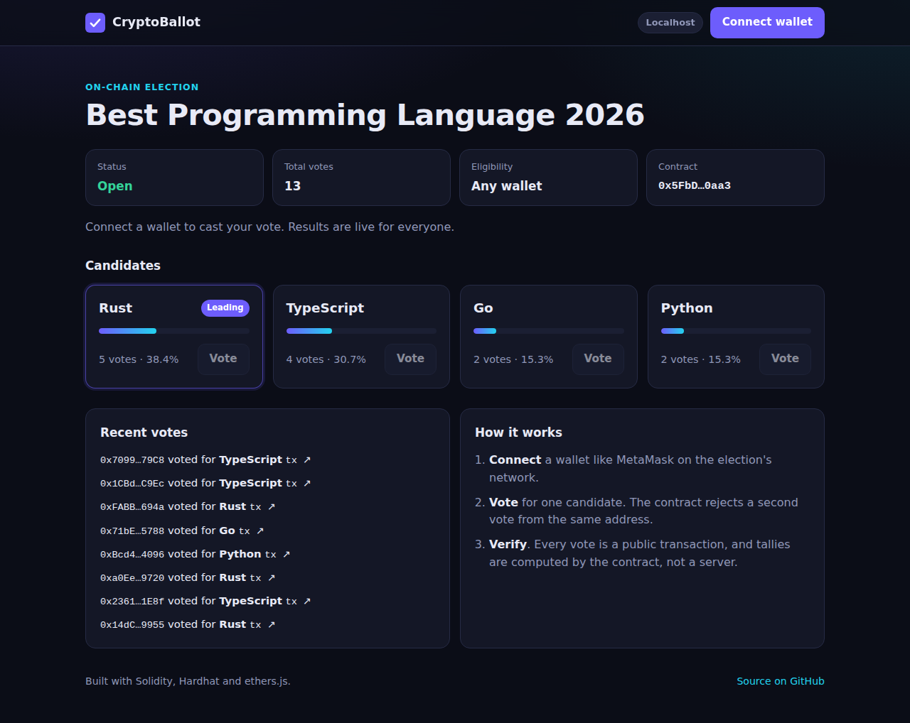
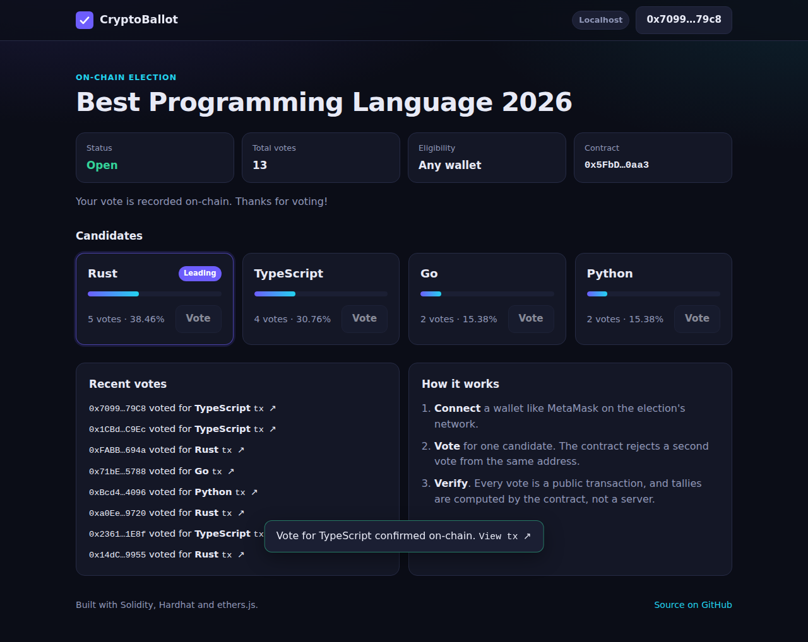
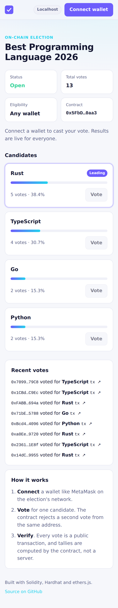
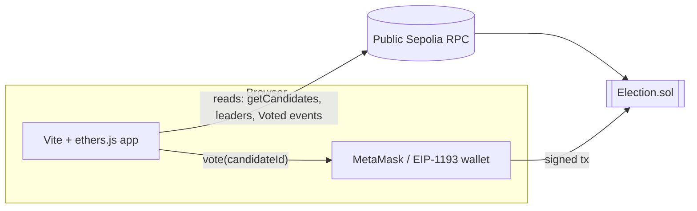

# CryptoBallot

[](https://github.com/eshanpandey/CryptoBallot/actions/workflows/ci.yml)
[](contracts/Election.sol)
[](LICENSE)

**A tamper-proof voting dApp on Ethereum.** One wallet, one vote, and results anyone can verify on-chain, with no server in the middle.

**[Live demo →](https://eshanpandey.github.io/CryptoBallot/)** (results are readable without a wallet; connect MetaMask on Sepolia to vote)



## Features

- **Smart contract election** with configurable title, candidates, optional voting deadline, and an optional admin-managed voter registry.
- **Enforced on-chain rules**: double votes, invalid candidates, late votes and unregistered voters all revert with descriptive custom errors.
- **Read-only mode for everyone**: the frontend reads tallies from a public RPC, so visitors see live results without installing a wallet.
- **Wallet voting** via MetaMask (or any EIP-1193 wallet) with automatic network switching, transaction status toasts and Etherscan links.
- **Live activity feed** built from `Voted` events, refreshed every 12 seconds.
- **Tie-aware results**: `leaders()` returns every candidate sharing the top vote count.
- **Tested and automated**: 21 Hardhat tests at 100% line coverage, Solhint linting, and GitHub Actions for CI, Pages hosting and one-click Sepolia deployment.

| Voting with a wallet | Mobile (light theme) |
| --- | --- |
|  |  |

## Architecture



- **`contracts/Election.sol`** holds all state: candidates, tallies, who has voted, the deadline and the registry. Tallies are computed by the contract itself, so the frontend is just a view.
- **`frontend/`** is a dependency-light Vite app (vanilla JS + ethers v6). It uses a `JsonRpcProvider` for reads and a `BrowserProvider` signer only when the user votes.
- **`scripts/deploy.js`** deploys the contract from `ballot.config.json` and writes the address and ABI to `frontend/src/deployments/<network>.json`, which the app picks up at build time.

### Contract API

| Function | Description |
| --- | --- |
| `vote(uint256 candidateId)` | Cast one vote. Reverts with `AlreadyVoted`, `InvalidCandidate`, `ElectionClosed` or `NotRegistered`. |
| `getCandidates()` | All candidates `{id, name, voteCount}` in one call. |
| `leaders()` | Id(s) of the current leader(s); empty before the first vote. |
| `canVote(address)` | Whether an address could vote right now. |
| `registerVoters(address[])` | Admin only, for restricted elections. |
| `title`, `admin`, `endsAt`, `restricted`, `totalVotes`, `hasVoted(address)` | Public state. |

## Running locally

Requires Node.js 20+ and MetaMask.

```bash
npm install
npm test                 # 21 contract tests
npm run node             # terminal 1: local Hardhat chain on :8545
npm run deploy:local     # terminal 2: deploy using ballot.config.json
npm run dev              # terminal 2: app on http://localhost:5173
```

In MetaMask, add the network `http://127.0.0.1:8545` (chain id 31337) and import one of the test private keys printed by `npm run node`.

Other scripts: `npm run coverage`, `npm run lint`, `npm run build`.

### Customising the ballot

Edit `ballot.config.json` before deploying:

```json
{
  "title": "Best Programming Language 2026",
  "candidates": ["Rust", "TypeScript", "Go", "Python"],
  "durationDays": 0,
  "restricted": false
}
```

`durationDays: 0` keeps voting open indefinitely; `restricted: true` limits voting to addresses the deployer registers with `registerVoters`.

## Deployment

The site is a static build hosted on **GitHub Pages**; the contract lives on the **Sepolia** testnet.

1. **Site**: in *Settings → Pages*, set *Source* to **GitHub Actions**. Every push to `main` that touches the frontend redeploys it. Until a contract is deployed, the site shows a clearly labelled preview with sample data.
2. **Contract**: add a `DEPLOYER_PRIVATE_KEY` repository secret for a wallet holding a little Sepolia ETH (from any Sepolia faucet), optionally `ETHERSCAN_API_KEY` to verify the source, then run *Actions → Deploy contract to Sepolia*. The workflow runs the tests, deploys, commits `frontend/src/deployments/sepolia.json` and republishes the site.

To deploy from your machine instead, copy `.env.example` to `.env`, fill it in, and run `npm run deploy:sepolia`, then commit the generated `frontend/src/deployments/sepolia.json`.

## Design notes and limitations

- **Sybil resistance** is only as strong as the eligibility rule: in open mode anyone can create many wallets. Restricted mode with an admin-curated registry is the realistic setting for real elections.
- **Votes are public.** Each vote is a transaction linking an address to a candidate. Ballot secrecy would need a commit-reveal scheme or zero-knowledge proofs (e.g. Semaphore), which is the natural next step.
- **The ballot is immutable after deployment**: candidates cannot be added or removed mid-election, by design.

## Project structure

```
contracts/Election.sol          Solidity contract
test/Election.test.js           Hardhat + Chai test suite
scripts/deploy.js               Deploys and exports address/ABI for the frontend
ballot.config.json              Election title, candidates, deadline, registry mode
frontend/                       Vite app (index.html, src/main.js, src/style.css)
.github/workflows/              CI, GitHub Pages, and Sepolia deploy pipelines
```

## License

[MIT](LICENSE)
